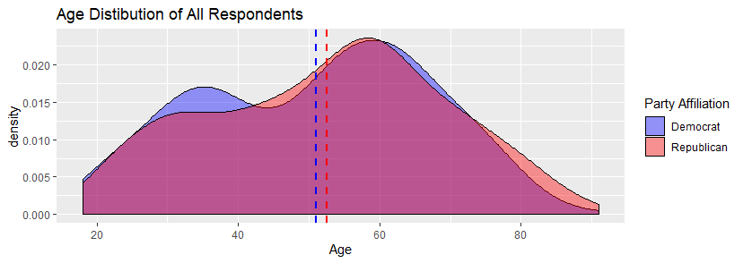
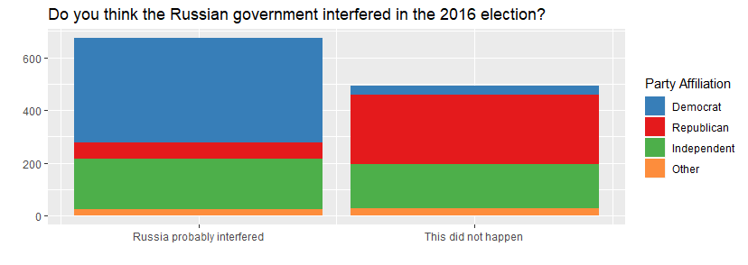

__Overview__

The mission of the American National Election Studies (ANES) is to advance the scientific study of public opinion and political behavior.  They accomplish this by developing and employing surveys that measure many variables and support rich hypothesis testing to assess voter turnout and vote choice.  The origins of their analysis started with a nation opinion survey conducted at the University of Michigan's Survey Research Center with the 1948 presidential election.  They continued to conduct surveys in every presidential election year through 2004.  In 2006, Stanford University's Institute for Research in the Social Sciences and the University of Michigan's Institute for Social Research developed a partnership which maintains and evolves the ANES.

Through the decades, Time Series studies conducted before and after presidential elections represent the focus of ANES studies.  Typically collection occurs via face-to-face interviews with respondents in their homes.  Pilot Studies are used to test and refine new questions for the Time Series.  These supporting studies are conducted telephonically.  The data assessed in this lab is from the 2018 Pilot Study.

ANES studies use procedures known as complex sampling instead of simple random sampling.  Some of the key methods that make ANES samples complex include:

- Oversampling.
- Startified cluster sampling.
- Within household sampling.


```{r}
setwd("~/Desktop/w203_lab2/w203_lab2")
anes_data <- read.csv("~/Desktop/W203/homework/lab_2/anes_pilot_2018.csv")
library(knitr)
opts_chunk$set(tidy.opts=list(width.cutoff=45),tidy=TRUE)
```

\pagebreak

__1. Do US voters have more respect for the police or for journalists?__

__Overview.__\
Within the ANES pilot questions, two specific ones directly support the posed question:

  - How would you rate the police?
  - How would you rate journalists?
  
Though these questions do not provide a holistic assessment of public opinion, the do provide a start point for an initial perspective on opinion trends.   


__Operationalization.__\
The context of these questions was in a 'feeling thermometer', as depicted in Figure 1. Using this approach, each respondent provides a numberical value which is in a categorical range from 0 too 100.  An issue with these questions is that they are structured to assess 'feelings towards' instead of 'respect for'. A further feature of this thermometer is the varied interpretation of the scale by respondents.

Values existed for all respondents for these two questions.  The expected range of the data for each of these survey questions is [0,100].  The police data meets this criteria; however, the press data does not.  This question possesses negative values, which indicates these was no respondent answer.  To prevent the results from being skewed by these values, the responses associated with those respondents were not included in the analysis.  Using this approach, the overall number of respondents reduced by 2.  The final data set analysed possessed data from 2498 respondents with values from 0 to 100 for both the press and police questions. 

__Exploratory Data Analysis.__\
```{r}
press <- anes_data$ftjournal
police <- anes_data$ftpolice
press_range <- range(press)  # press_range # [-7,100]
police_range <- range(police) # police_range # [0,100]
trust_data <- data.frame(police,press)
# subset(press_data, press == -7)
# press_data <- press_data[!subset(press_data, press == -7)]
trust_data <- trust_data[-c(51),] # delete row with -7 value
trust_data <- trust_data[-c(597),] # delete row with -7 value
```


__Analysis__\
Though the data is numberical in nature, indivduals will use different scales when assessing their relative values on the thermometer.  Consequently, a linear relationship cannot be assumed to exist between the values.  This data feature supports the use of a non-parametric hypothesis test - namely the Wilcoxon Rank-Sum Test.  Employing the Hypothesis of Means for $H_O$ for this analysis capitalizes on the metric scale that the thermometer context provides.  For this question, the hypotheses tested were:\
\begin{center}
  - Null:  The means of the two groups is the same. $H_0:  E(Press) = E(Police)$
  
  - Alternative:  The means of the two groups are not the same.  $H_A:  E(Press) \neq E(Police)$
\end{center}

```{r}
x <- trust_data$police # police data
y <- trust_data$press # press data
# length(x); length(y)
wilcox.test(x,y, paired = FALSE, mu = 0, conf.level = 0.95)
```

__Outcome.__\
  __Statistical Signficance.__ The p-value obtained from the Wilcoxon rank-sum test supports rejecting the null hypotheses - namely that there is no translation in the distributions of public opinion of the police and the press.\
  __Practical Significance.__  Spearman's rank correlation coefficient represents an effective way to assess the practical significance of the police and press analysis.  It provides a non-parametric measure of rank correlation, which aligns to the hypothesis test.

```{r}
cor(x,y, method = "spearman")
```
- The values for Spearman's Rank-Order Correlation, $r_s$, can take on the values from $+1$ to $-1$.  $r_s$ has the following associations:\
  - $+1$:  perfect association of ranks\
  - $0$:   no association between the ranks\
  - $-1$:  perfet negative association of ranks.

The $r_s$ value obtained from this test was -0.123.  This indicates a weak negative correlation between the public opinion of the press and the police.

\pagebreak

__2.  Are Republican voters older or younger than Democratic voters?__

__Overview.__\
Of keen interest in politics is the age of voters.  This has emerged as a topic of interest with the pubilc as it relates to enhanced gun control laws.  Youth affected by school mass shootings have opened the debate on whether the federal voting age in the United States should be lowered from 18 to 16.  The 26th Ammendment to the US Constitution establishes the voting age.  Though it was originally set at 21 years of age, a student movement in the 1960s in the midst of the Vietnam War lobbied for the age to be dropped to 18.  Armed with the slogan:  old enough to fight, old enough to vote', the movement successfully lobbied Congress to lower the voting age to 18 for national elections.

__Operationalization.__\
Two entries within the survey directly support establishing a frame for this question.  These two questions are:\
- What year were you born?\
- Generally speaking, do you usually think of yourself as a Democrat, a Republican, an Independent, or what?

Together, these questions, along with the assmption that surveyed individuals provided truthful data for these questions, creates an informed estimate for approaching the question of which party has older voters.  The age of the respondent is a numberical value which subtracts 2018 from the provided respondent birth year.  Their party affiliation is categorical, and is a best estimate assessment of an individual's political association. 

__Exploratory Data Analysis.__\
This type of data supports using the independent sample t-test.  One set of data is numberical (respondents' ages), and the other is categorical (Republican or Democrat). With this test, we conducted a comparison of means.  The hypotheses being tested were:\
 $$H_0: E(Republicans) = E(Democrats)$$
 $$H_A: E(Republicans) \neq E(Democrats)$$
 
 Assumptions needed for this analysis include:\
  - Metric scale.  The age data meets this assumption.\
  - Each value pair is drawn independent of other pairs from the same distribution.
  - The two variables have the same distribution, just with some potential shift.
```{r}
partisans = anes_data[which(anes_data$pid1d ==c(1,2)),] # 1 = democrat, 2 = republican
age = 2018 - partisans$birthyr
party = partisans$pid1d
partisanAge = data.frame(age, party)
```


__Analysis.__\

```{r}
t.test(age ~ party, data = partisans)
```
__Statistical signifcance.__  The high p-value from this test, 0.547 indicates that the null hypothesis cannot be rejected.  

__Practical significance.__  The Cohen's d test supports determining the effect size for the analysis.  With this test, the outcome value (d = -0.0624) indicates that there is only a small effect present with this test.  

```{r}
library(effsize)
cohen.d(age ~ party, data = partisans)
```

Thus far, we have only addressed individuals who identified themselves as either Republicans or Democrats.  What has yet to be addressed is whether they voted.  One of the survey questions captures whether respondents voted in the election held the month prior (November 2018).  Integrating this criteria into the dataset gives some further insights into party voters.


```{r}
partisansVoted = partisans[which(partisans$turnout18 == c(1,2,3)),]
t.test(2018 - partisansVoted$birthyr ~ partisansVoted$pid1d, data = partisansVoted)
```

__Outcome.__\
Including the constraint of having voted in the previous month's election conveys a distinctly different picture.  The p-value no longer supports not rejecting the null hypothesis.  The data does not support that the difference in means is zero.  A point of note is that for the Democrats, the average age between the two scenarios stayed quite constant (51.7 and 51.1).  However, for the Republicans, the average age of those that voted in the November election was 8 years older than Republicans at large from the survey.

```{r}
library(effsize)
cohen.d(2018 - partisansVoted$birthyr ~ partisansVoted$pid1d, data = partisansVoted)
```
Re-assessing the practical significance of the results on the adjusted dataset with the Cohen's d test now indicates a medium effect size.  These results indicate that the average age of Democrats at large in the survey and those that voted in the November 2018 election are consistent.  However, Republicans that voted in the November 2018 election are on average 8 years older than Republicans at large in the survey.

\pagebreak

__3. Do a majority of independent voters believe that the federal investigations of Russia election interference are baseless?__

__Overview.__\
Prior to the 2016 presidential election, members of the US Congress publically disclosed the existence of attempted Russian interference activities. Robert Mueller, a former FBI director, led a Special Counsel Investigation from May 2017 to March 2019. the intent of this Special Counsel investigation was an investigation of Russian interference in the 2016 US elections and of suspicious links between President Trump and Russian officials.  This survey occurred while Mueller's investigation was ongoing.

__Operationalization.__\
Within the survey a specific section was dedicated to the Russia/Trump campaign investigation.  Three questions exist on this topic, which are:\

- Do you think the Russian government probably interfered in the 2016 presidential election to try and help Donald Trump win, or do you think this probably did not happen?\
- Do you think Donald Trump's 2016 campaign probably coordinated with the Russians, or do you think his campaign probably did not do this?\
- Do you approve, disapprove, or neither approve nor disapprove of Robert Mueller's investigation of Russian interference in the 2016 election?\

The first two questions generate a binomial response.  The final questions has a Likert approach to assess the respondent's opinion.  No one question directly answers the question posed.  Focusing on the baseless aspect, the first two questions with a binomial response option represent the best approach to evaluate for the baseless criteria of the question.  

__Explorataory Data Analysis.__\


```{r}

russia_involvement <- data.frame(anes_data$pid1d, anes_data$turnout18, anes_data$russia16, anes_data$coord16, anes_data$muellerinv)
colnames(russia_involvement) <- c("party", "voted", "russia_1", "russia_2")
russia_involvement<- russia_involvement[which(russia_involvement$party == c(3)),] # isolate independent voters - 356
# russia_involvement<- russia_involvement[which(russia_involvement$voted == c(1,2,3)),] # isolated those who voted in 2018
```

```{r}
summary(russia_involvement$russia_1)
summary(russia_involvement$russia_2)

```

```{r}
library("RColorBrewer")
partyIdentified = data.frame(anes_data[which(anes_data$pid1d > 0 & anes_data$russia16 > 0 & anes_data$coord16 > 0),])
russiaByParty = data.frame( party = partyIdentified$pid1d, russia = partyIdentified$russia16, coord = partyIdentified$coord16, mueller = partyIdentified$muellerinv )

ggplot(russiaByParty, aes(x = russia, fill=factor(party), width=0.5)) + geom_bar()  + scale_fill_manual(values = c("#377EB8", "#E41A1C", "#4DAF4A", "#FD8D3C"),  breaks=c(1, 2, 3, 4), labels=c("Democrat", "Republican", "Independent", "Other")) + scale_x_continuous(breaks=c(1,2), labels = c("Russia probably interfered", "This did not happen")) + xlab("") + ylab("") + labs(fill="Party Affiliation", title = "Do you think the Russian government interfered in the 2016 election?")
```



A particularly interesting feature of the data is that the responses almost completely align to party lines.  Data for respondents that voted for each of the identified parties - Republican, Democrat, and Independent, is depicted in the table below.

```{r}
library(knitr)
library(stargazer)
Independent_Russia <- c(1.463, 1.517)
Democrats_Russia <- c(1.056, 1.067)
Republicans_Russia <- c(1.812, 1.892)
headers <- c("Independent", "Democrat", "Republican")
russia_outcome <- data.frame(Independent_Russia, Democrats_Russia, Republicans_Russia)
kable(russia_outcome,caption = "Russia Coordination Perception", col.names = headers)
```

The survey respondents consistently aligned to their party affiliation - Democrats aligned to the presence of influence, while Republicans were skewed towards the opinion of no involvment.  Independent affiliated respondents roughly split the diffence between the two extremes.  This reflects that individual responses are directly aligned to their party affiliation.  

Given the binomial nature of the response data (interference/no interference), and the intent to identify a majority, a binomial test represents an effective approach to answer the question utilizing the survey data.  A binomial test compares the number of successes observed in a given number of trials with a hypothesised probability of success $p$.  
$$H_O:  p = 0.5$$
$$H_A:  p \neq 0.5$$
With this alternative hypothesis, a two-tail test is done, as it is unknown if the surveyed independent voters are skewed towards either the Republican or Democrat party position.

Assumptions for the binomial test include:
- Items are dichotomous and nominal.  
- The sample size is significantly less than the population size.
- The sample is a fair representation of the population.
- Sample items are independent.

By assuming that the surveyed independent voters are a fair representation of their party affiliation, all the assumptions are met for the binomial test.

__Analysis.__\

```{r}
russia16_len <- length(russia_involvement$russia_1)
russia16_true <- sum(as.numeric(russia_involvement$russia_1) == 1)
binom.test(russia16_true, russia16_len, p = 0.50, alternative = "two.sided", conf.level = 0.95)
```

```{r}
coord16_len <- length(russia_involvement$russia_2)
coord16_true <- sum(as.numeric(russia_involvement$russia_2) == 1)
binom.test(coord16_true, coord16_len, p = 0.5, alternative = "two.sided", conf.level = 0.95)
```

```{r}
cohen.d(russia_1 ~ russia_2, data = russia_involvement)
```

__Outcome.__

__Statistical Significance.__  The large p-values, p = 0.1851 and  p = 0.56 for each of the binomial survey questions support not rejecting the null hypothesis.\
__Practical Significance.__  The Cohen's d effect size value, d = -2.358, indicates that there is a large effect present between the two survey questions.

As for whether a majority of independent voters believe that the federal investigations of Russia election interference are baseless, these two survey questions do not provide a conclusive answer to the question.

\pagebreak


__4. Was anger or fear more effective at driving increases in voter turnout from 2016 to 2018?__

__Overview.__\
Voter turnout varies greatly by state.  Many factors influence this to include:\

- __Electoral Competitiveness.__  Voters in the 12 most competitive states tend to turn out at a higher rate than those in the other 39 states and the District of Columbia.
- __Election Type.__  Primary elections and off-year state elections consistently have low turn-outs.
- __Voting Laws.__  Early voting and accessability of polling places impact voter turnout.
- __Demographics.__  Age, wealth, education, and gender all have identifable impacts on voter turnout. 
Amidst all these factors, this question singles out one specifically.  It seeks to understand the impact that anger and fear had on voter turnout.  

__Operationalization.__\
No set of survey questions directly answers this question. To approach it, two distinct parts were considered:  identify voter and then identify what makes them fearful or angry.  To identify voters, the questions addressing voter turnout in 2016 and 2018 provide the best initial insight on voting respondents.  

Below are initial data checks for consistency:

```{r}

summary(anes_data$turnout16)
summary(anes_data$turnout18)
```

There are no non-responses, only respondents who are not sure if they voted, as per the codebook. Three response options exist for the 2016 election:  voted (1), didn't vote (2), and not sure (3).  The 2018 question expanded the options to five in order to capture the method the voting method of respondents:  in person on 6 Nov (1), in person before 6 Nov (2), by mail (3), didn't vote (4) and not sure (5). Filtering the results for confirmed voters in 2016 and 2018, an net increase of 1 exists between 2016 and 2018.  This outcome challenges the assumption in the posed question,  namely the premise that voter turnout increased significantly from 2016 to 2018.

```{r}
#get all of our voters from 2016 who are sure they voted
voters16 = anes_data[which(anes_data$turnout16 == 1),] 

#get all of our voters from 2018 who are sure they voted
voters18 = anes_data[which(anes_data$turnout18 < 4),] 
nrow(voters18) - nrow(voters16) # difference of voters
```

A variety of survey questions address fear and anger in respondents, a global question about the direction of the country as a whole, and specific questions about what emotions the respondents felt about Donald Trump. Responses from the global emotion portion of the survey were examined to initially evaluate fear and anger in voters.  The overall question posed was:  "Generally speaking, how do you feel about the way things are going in the country these days?" 10 different emotions were surveyed on a Likert scale.  Responses to two of these provide an indicator for fear and anger, though there is no way to attribute it directly to voter turnout: 

```{r}
# this is an alternate approach to the question using the signed rank test and paired values for respondent answers to angry and afraid....I apologize for the coding up front.....
q4 <- data.frame(anes_data$geangry, anes_data$geafraid, anes_data$turnout16, anes_data$turnout18)
lengths(q4)
new_q4 <- q4[which (q4$anes_data.turnout16==1),]

# & q4$anes_data.turnout18==c(1,2,3),]
lengths(new_q4)
voters_q4 <- new_q4[which (new_q4$anes_data.turnout18==c(1,2,3)),]
lengths(voters_q4)
summary(voters_q4)
```

```{r}
wilcox.test(voters_q4$anes_data.geangry, voters_q4$anes_data.geafraid, alternative = "two.sided", mu = 0, paired = TRUE, conf.level = 0.95)

angry <- voters_q4$anes_data.geangry
afraid <- voters_q4$anes_data.geafraid
compare_q4 <- data.frame(angry,afraid)
cor(angry, afraid, method = "spearman")
```

```{r}
library(BSDA)
SIGN.test(angry, afraid, md = 0, alternative = "two.sided", conf.level = 0.95)
```


A variety of survey questions address fear and anger in respondents.  Responses from the global emotion portion of the survey were examined to initially evaluate fear and anger in voters.  The overall question posed was:  "Generally speaking, how do you feel about the way things are going in the country these days?" 10 different emotions were surveyed on a Likert scale.  Responses to two of these provide one indicator for fear and anger, though there is no way to attribute it directly to voter turnout: 

\begin{center}
- "How angry do you feel?"\

- "How afraid do you feel?"
\end{center}

__Exploratory Data Analysis.__

```{r}
library(ggplot2)
#get all of our voters who answered both the angry and afraid questions
geVoters18 = voters18[which(as.numeric(voters18$geangry) > 0 & as.numeric(voters18$geafraid) > 0),] 
#frame each variable
question4frame = data.frame(emotion = c(rep("angry", nrow(geVoters18)), rep("afraid", nrow(geVoters18))), response = c(geVoters18$geangry, geVoters18$geafraid))
#plot it
ggplot(question4frame, aes(x = question4frame$response, fill=emotion), stat="count") + geom_histogram(binwidth=1, position="dodge") + scale_x_continuous(breaks = c(1,2,3,4,5), labels=c("Not at all", "A little","Somewhat", "Very", "Extremely")) + labs(title="Anger and Fear in 2018 Election Voters", y="", x=" How do you feel about the way things are going in the country these days?")

```

We can see that there seems to be more 'very' and 'extreme' responses for anger than for fear and more "Not at all" and "A little" responses for afraid:


__Outcome.__

We could test our hypotheses that the responses are different for the two questions:
\begin{center}
 - $H_0: E(Fear) = E(Anger)$\
 - $H_A: E(Fear) \neq E(Anger)$
\end{center}

Testing against a null hypothesis that there is no difference between the anger responses and the fear responses shows that there is a significant difference between the two:

```{r}
wilcox.test(geVoters18$geangry, geVoters18$geafraid,  alternative = "two.sided")
```

Going further, we can now test whether anger is indeed more significant than fear, or
\begin{center}
 - $H_0: E(Fear) \geq E(Anger)$.\
 - $H_A: E(Fear) < E(Anger)$
\end{center}

```{r}
wilcox.test(geVoters18$geangry, geVoters18$geafraid, null="less", alternative = "greater")
```

```{r}
# cohen.d(geangry ~ geafraid, data = geVoters18)
```


__Statistical significance.__ This gives us a p-value = 2.293e-12 so we should reject our null hypothesis that 2018 election voters feel more fear than anger about the state of affairs in the country.

__Practical significance.__ 

The question asks about an increase in voters. From our survey we can't be sure that there is an increase in voters. Moreover we also cannot make claims about what is motivating those voters to vote. We can however see that in general they report feeling anger than fear about the state of the country.

\pagebreak

__5. Does household income affect how much attention reponsdents pay to politics and public affairs?__

__Overview.__\
For our self-selected question we chose to focus on whether household income affects how how closely respondents followed politics.

__Operationalization.__\
Respondents were asked for household income using the question "Thinking back over the last year, what was your family’s annual income?”, this is encoded as `faminc_new`

__Exploratory Data Analysis.__\

"Decline to answer" is encoded as a 97, so we'll want to remove those rows in order to use `faminc_new`.

```{r}
summary(anes_data$faminc_new)
hist(anes_data$faminc_new[anes_data$faminc_new < 20], main = "Family's Annual Income", xlab = "Annual Income", ylab = "Count", breaks = 20)
```


```{r}
validWealthRespondents = anes_data[which(as.numeric(anes_data$faminc_new) > 0 & as.numeric(anes_data$faminc_new) < 20),]
```

The scale is not perfectly metric, a '3' corresponds to a family income between \$20,000 and \$29,000 but an 11 indicates a family income between \$120,000 - \$149,999.

Respondents were also asked how closely they followed politics on the following scale: 

Most of the time [1]
Some of the time [2]
Only now and then [3]
Hardly at all [4]

This variable is a Likert scale, so we'll need to ensure that we treat them both as non-metric.

__Analysis.__\

We can compare the means of our wealth respondents and our entire survey to see whether the two groups differ dramatically:

```{r}
#   t.test(anes_data$follow, validWealthRespondents$follow)
```

This shows a p-value = 0.6272, so we cannot reject the null hypothesis that these two groups show no difference in means.

We can now begin to look at whether there is a difference in the household income levels for those who answered that the follow politics most of the time and those that answered that they hardly ever do. We get an intuition for this by graphing it:

```{r}
library(wesanderson)
q5frame = data.frame(validWealthRespondents)
ggplot(q5frame, aes(x=factor(q5frame$follow), y=q5frame$faminc_new, fill=factor(q5frame$follow))) + 
  geom_boxplot() + 
  scale_fill_manual(values = wes_palette("Zissou1", n = 4), name="Following politics", labels = c("Most of the time", "Some of the time", "Only now and then", "Hardly ever")) + 
  xlab("How closely do you follow politics?") + 
  scale_x_discrete(labels = c("Most of the time", "Some of the time", "Only now and then", "Hardly ever")) + 
  scale_y_continuous(name="Household Income", labels=c("$40k-$49k", "$100k-$119k", "$350k-$499k"), breaks=c(5, 10, 15))
```


The median family income for those who report following politics "closely "most of the time" does appear to be higher than those that report following it "hardly ever".

Since neither the family income nor the following politics responses are metric we should examine a possible relationship between these two variables using the Wilcoxon test. We'll isolate respodents who claimed to follow politics "most of the time" and those who claimed they followed politics "hardly ever" and see whether the two are different from our whole sample set.

```{r}
activeWithWealth = validWealthRespondents[which(as.numeric(validWealthRespondents$follow) == 1),]
inActiveWithWealth = validWealthRespondents[which(as.numeric(validWealthRespondents$follow) == 4),]
```

First we can look at whether the wealth levels for our "most of the time" respondents differ from all of our wealth respondents:
\begin{center}
 - $H_0: E(Followers) = E(All)$.\
 - $H_A: E(Followers) \neq E(All)$
 \end{center}

```{r}
wilcox.test(activeWithWealth$faminc_new, validWealthRespondents$faminc_new, conf.int=TRUE )
```

With a p-value = 8.303e-16 this appears to be statistically significant. 

Next we can look at whether the wealth levels for our "most of the time" respondents differ from all of our wealth respondents:

 - $H_0: E(Nonfollowers) = E(All)$.\
 - $H_A: E(Nonfollowers) \neq E(All)$

```{r}
wilcox.test(inActiveWithWealth$faminc_new, validWealthRespondents$faminc_new, conf.int=TRUE )
```


__Outcome.__\
__Practical significance.__ This also appears statistically significant, with a p-value < 2.2e-16.

Since the means of both groups differ significantly from the means of the larger population that answered the question we can explore whether there is a correlation between the family income and the self-reported following of politics:

```{r}
# 5 - validWealthRespondents$follow to invert the scale so that less interest is a 1 and more interest is a 4
cor(validWealthRespondents$faminc_new, 5 - validWealthRespondents$follow, method = "spearman")
```

__Practical Significance.__ The values for Spearman's Rank-Order Correlation, $r_s$, can take on the values from $+1$ to $-1$.  $r_s$ has the following associations:\
  - $+1$:  perfect association of ranks\
  - $0$:   no association between the ranks\
  - $-1$:  perfet negative association of ranks.

The $r_s$ value obtained from this test was 0.35 which is a weak monotonically increasing relationship.  Because of the sample size and p-value obtained, we believe that this indicates a correlation between family income of the respondents and the closeness with which they follow politics.

