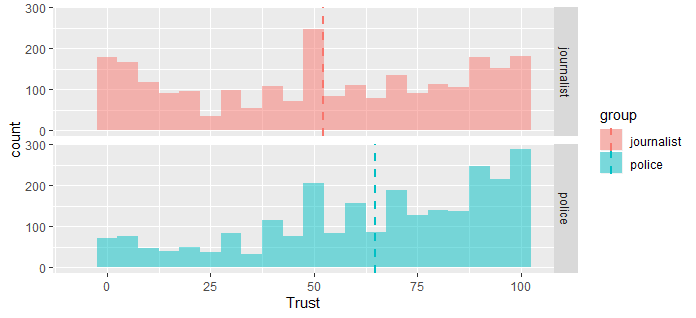
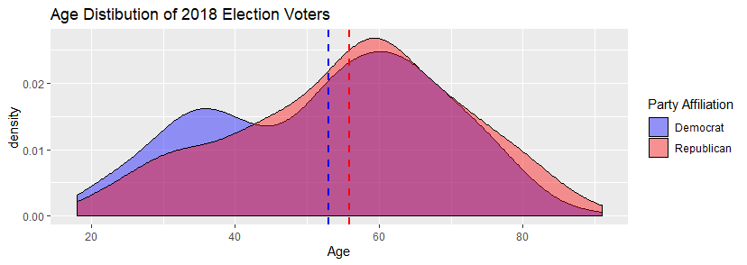
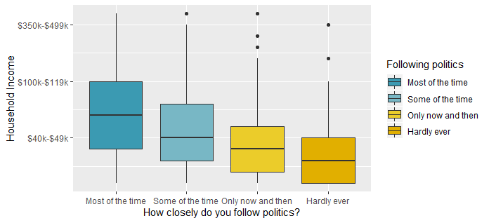

The mission of the American National Election Studies (ANES) is to advance the scientific study of public opinion and political behavior.  They accomplish this by developing and employing surveys that measure many variables and support rich hypothesis testing to assess voter turnout and vote choice.  The origins of their analysis started with a nation opinion survey conducted at the University of Michigan's Survey Research Center with the 1948 presidential election.  They continued to conduct surveys in every presidential election year through 2004.  In 2006, Stanford University's Institute for Research in the Social Sciences and the University of Michigan's Institute for Social Research developed a partnership which maintains and evolves the ANES.

Through the decades, Time Series studies conducted before and after presidential elections represent the focus of ANES studies.  Typically collection occurs via face-to-face interviews with respondents in their homes.  Pilot Studies are used to test and refine new questions for the Time Series.  These supporting studies are conducted telephonically.  The data assessed in this lab is from the 2018 Pilot Study.


```{r}
setwd("~/Desktop/W203/homework/lab_2")
anes_data <- read.csv("~/Desktop/W203/homework/lab_2/anes_pilot_2018.csv")
```

__1. Do US voters have more respect for the police or for journalists?__

__Overview__
Within the ANES pilot questions, two specific ones directly support the posed question:

  - How would you rate the police?\
  - How would you rate journalists?
  
Though these questions do not provide a holistic assessment of public opinion, the do provide a start point for an initial perspective on sentiment trends.  This will provide a start point to compare the public opinions captured in the pilot study.

The context of these questions was in 'feeling thermometers' which have a numerical range from 0 too 100.

__Initial Assessment__
```{r}
press = anes_data$ftjournal
police = anes_data$ftpolice
press_range = range(anes_data$ftjournal) # [-7,100]
police_range = range(anes_data$ftpolice) # [0,100]
```

Values existed for all respondents for these two questions.  The expected range of the data for each of these survey questions is [0,100].  The police data meets this criteria; however, the press data does not.  This question possesses negative values, which indicates these was no respondent answer.  To prevent the results from being skewed by these values, the responses associated with those respondents were not included in the analysis.  Using this approach, the overall number of respondents reduced by 2.

```{r}
valid_responses = subset(anes_data,  anes_data$ftjournal >= 0 & anes_data$ftpolice >= 0)
trust_data = data.frame(police = valid_responses$ftpolice, press = valid_responses$ftjournal)
```

The final data set analysed possessed data from 2498 respondents with values from 0 to 100 for both the press and police questions. 



Though the data is numerical in nature, indivduals will use different scales when assessing their relative values on the thermometer.  Consequently, a linear relationship cannot be assumed to exist between the values.  This data feature supports the use of a non-parametric hypothesis test - namely the Wilcoxon Rank-Sum Test.  Employing the Hypothesis of Means for $H_O$ for this analysis capitalizes on the metric scale that the thermometer context provides.  For this question, the hypotheses tested were:
  - Null:  The means of the two groups is the same. $H_0:  E(Press) = E(Police)$
  - Alternative:  The means of the two groups are not the same.  $H_A:  E(Press) \neq E(Police)$

__Analysis__


```{r}
wilcox.test(trust_data$police, trust_data$press, paired = TRUE, mu = 0, conf.level = 0.95)
``` 


__Outcome.__ 
  - Statistical Signficance. The p-value obtained from the Wilcoxon rank-sum test supports rejecting the null hypotheses - namely that there is no translation in the distributions of public opinion of the police and the press.
  - Practical Significance.  Spearman's rank correlation coefficient represents an effective way to assess the practical significance of the police and press analysis.  It provides a non-parametric measure of rank correlation, which aligns to the hypothesis test.

```{r}
cor(trust_data$police, trust_data$press, method = "spearman")
```
- The values for Spearman's Rank-Order Correlation, $r_s$, can take on the values from $+1$ to $-1$.  $r_s$ has the following associations:\
  - $+1$:  perfect association of ranks\
  - $0$:   no association between the ranks\
  - $-1$:  perfet negative association of ranks.

The $r_s$ value obtained from this test was -0.123.  This indicates a weak negative correlation between the public opinion of the press and the police.

\pagebreak

__2.  Are Republican voters older or younger than Democratic voters?__

__Overview.__
Two entries within the survey directly support establishing a frame for this question.  These two questions are:\
- What year were you born?\
- Generally speaking, do you usually think of yourself as a Democrat, a Republican, an Independent, or what?

Together, these questions, along with the assmption that surveyed individuals provided truthful data for these questions, creates an informed approach to answering which party has older voters.  The age of the respondent is a numberical value, and their party affiliation is categorical.  

__Initial Assessment.__
This type of data supports using the independent sample t-test.  One set of data is numberical (respondents' ages), and the other is categorical (Republican or Democrat). With this test, we conducted a comparison of means.  The hypotheses being tested were:\
 - $H_0: E(Republicans) = E(Democrats)$.\
 - $H_A: E(Republicans) \neq E(Democrats)$
 
 Assumptions needed for this analysis include:\
  - Metric scale.  The age data meets this assumption.\
  - Each value pair is drawn independent of other pairs from the same distribution.
  - The two variables have the same distribution, just with some potential shift.
```{r}
partisans = anes_data[which(anes_data$pid1d ==c(1,2)),] # 1 = democrat, 2 = republican
age = 2018 - partisans$birthyr
party = partisans$pid1d
partisanAge = data.frame(age, party)
```


__Analysis.__

```{r}
t.test(age ~ party, data = partisanAge)
```
Statistical signifcance.  The high p-value from this test, 0.547 indicates that the null hypothesis cannot be rejected.  

Practical significance.  The Cohen's d test supports determining the effect size for the analysis.  With this test, the outcome value (d = -0.06) indicates that there is only a small effect present with this test.  

```{r}
library(effsize)
cohen.d(age ~ party, data = partisanAge)
```

Thus far, we have only addressed individuals who identified themselves as either Republicans or Democrats.  What has yet to be addressed is whether they voted.  One of the survey questions captures whether respondents voted in the election held the month prior (November 2018).  Integrating this criteria into the dataset gives some further insights into party voters.



```{r}
partisansVoted = partisans[which(partisans$turnout18 == c(1,2,3)),]
t.test(2018 - partisansVoted$birthyr ~ partisansVoted$pid1d, data = partisansVoted)
```

__Outcome.__
Including the constraint of having voted in the previous month's election conveys a distinctly different picture.  The p-value no longer supports not rejecting the null hypothesis.  The data does not support that the difference in means is zero.  A point of note is that for the Democrats, the average age between the two scenarios stayed quite constant (51.7 and 51.1).  However, for the Republicans, the average age of those that voted in the November election was 8 years older than Republicans at large from the survey.

```{r}
library(effsize)
cohen.d(2018 - partisansVoted$birthyr ~ partisansVoted$pid1d, data = partisansVoted)
```
Re-assessing the practical significance of the results on the adjusted dataset with the Cohen's d test now indicates a medium effect size.  These results indicate that the average age of Democrats at large in the survey and those that voted in the November 2018 election are consistent.  However, Republicans that voted in the November 2018 election are on average 8 years older than Republicans at large in the survey.

\pagebreak

__3. Do a majority of independent voters believe that the federal investigations of Russia election interference are baseless?__

__Overview.__

__Initial Assessment.__
```{r}

q3 <- data.frame(anes_data$pid1d, anes_data$turnout18, anes_data$russia16, anes_data$coord16)
colnames(q3) <- c("party", "voted", "russia_1", "russia_2")
q3<- q3[which(q3$party == c(3)),] # isolate independent voters
q3<- q3[which(q3$voted == c(1,2,3)),] # isolated those who voted in 2018
# head(q3_v1)
```
__Analysis.__
```{r}
t.test(q3$russia_1, alternative = c("two.sided"), mu = 1)
```
The second question does not generate enough respondents to effectively conduct a test (df = 15).

```{r}
# q3<- q3[which(q3$party == c(3)),] # isolate independent voters
# q3<- q3[which(q3$voted == c(1,2,3)),] # isolated those who voted in 2018
# head(q3_v2)
t.test(q3$russia_2, alternative = c("two.sided"), mu = 1)
```

__Outcome.__
A particularly interesting feature amongst respondants is that their responses almost completely align to party lines.  When re-doing the data for respondents that voted for each of the identified parties - Republican, Democrat, and Independent, each outcome is unique.

```{r}
library(knitr)
v1 <- c(1.423)
v2 <- c(1.025)
v3 <- c(1.848)
headers <- c("Independent", "Democrat", "Republican")
russia_outcome <- data.frame(v1,v2,v3)
kable(russia_outcome, caption = "Russia Coordination Perception", col.names = headers)
```

\pagebreak

__4. Was anger or fear more effective at driving increases in voter turnout from 2016 to 2018?__


The question asks us to understand reasons for an increase in voter turnout. 

__Initial Assessment.__

First we should check our data for consistency:

```{r}

summary(anes_data$turnout16)
summary(anes_data$turnout18)
```

There are no non-responses, only respondents who are not sure if they voted, as per the codebook. We can filter these to find respondents who are sure they voted in 2016 and in 2018:

```{r}
voters16 = anes_data[which(anes_data$turnout16 == 1),] #get all of our voters from 2016 who are sure they voted
voters18 = anes_data[which(anes_data$turnout18 < 4),] #get all of our voters from 2018 who are sure they voted

nrow(voters18) - nrow(voters16)
```

We can see an increase of 1 vote from 2018 to 2016 so it appears that the principle assumption of this question, that there was an increase in votes 2018 vs 2016, is incorrect. We can however see whether voters from both of these elections feel more angry or afriad by using the question "Generally speaking, how do you feel about the way things are going in the country these days?" There are two Likert scale responses that seem to give an indication of fear vs anger: "How angry do you feel?" and "How afraid do you feel?".

__Analysis.__

```{r}
#get all of our voters who answered both the angry and afraid questions
geVoters18 = voters18[which(as.numeric(voters18$geangry) > 0 & as.numeric(voters18$geafraid) > 0),] 
#frame each variable
question4frame = data.frame(emotion = c(rep("angry", nrow(geVoters18)), rep("afraid", nrow(geVoters18))), response = c(geVoters18$geangry, geVoters18$geafraid))
#plot it
ggplot(question4frame, aes(x = question4frame$response, fill=emotion), stat="count") + geom_histogram(binwidth=1, position="dodge") + scale_x_continuous(breaks = c(1,2,3,4,5), labels=c("Not at all", "A little","Somewhat", "Very", "Extremely")) + labs(title="Anger and Fear in 2018 Election Voters", y="", x=" How do you feel about the way things are going in the country these days?")

```

We can see that there seems to be more 'very' and 'extreme' responses for anger than for fear:


__Outcome.__

We could test our hypotheses that the responses are different for the two questions:

 - $H_0: E(Fear) = E(Anger)$.\
 - $H_A: E(Fear) \neq E(Anger)$

Testing against a null hypothesis that there is no difference between the anger responses and the fear responses shows that there is a significant difference between the two:

```{r}
wilcox.test(geVoters18$geangry, geVoters18$geafraid,  alternative = "two.sided")
```

Going further, we can now test whether anger is indeed more significant than fear, or

 - $H_0: E(Fear) \geq E(Anger)$.\
 - $H_A: E(Fear) < E(Anger)$
 
 ```{r}
wilcox.test(geVoters18$geangry, geVoters18$geafraid, null="less", alternative = "greater")
```
This gives us a p-value = 2.293e-12 so we should reject our null hypothesis that 2018 election voters feel more fear than anger about the state of affairs in the country.

__5. Does household income affect how much attention reponsdents pay to politics and public affairs?

For our self-selected question we chose to focus on whether household income affects how how closely respondents followed politics.

__Initial Assessment.__

Respondents were asked for household income using the question "Thinking back over the last year, what was your family’s annual income?”, this is encoded as `faminc_new`

 ```{r}
 summary(anes_data$faminc_new)
hist(anes_data$faminc_new)
```

"Decline to answer" is encoded as a 97, so we'll want to remove those rows in order to use `faminc_new`.

```{r}
validWealthRespondents = anes_data[which(as.numeric(anes_data$faminc_new) > 0 & as.numeric(anes_data$faminc_new) < 20),]
```

The scale is not perfectly metric, a '3' corresponds to a family income between \$20,000 and \$29,000 but an 11 indicates a family income between \$120,000 - \$149,999.

Respondents were also asked how closely they followed politics on the following scale: 

Most of the time [1]
Some of the time [2]
Only now and then [3]
Hardly at all [4]

We can compare the means of our wealth respondents and our entire survey to see whether the two groups differ dramatically:

 ```{r}
t.test(anes_data$follow, validWealthRespondents$follow)
```

This shows a p-value = 0.6272, so we cannot reject the null hypothesis that these two groups show no difference in means.

__Analysis__

We can now begin to look at whether there is a difference in the household income levels for those who answered that the follow politics most of the time and those that answered that they hardly ever do. We get an intuition for this by graphing it:

```{r}
q5frame = data.frame(validWealthRespondents)
ggplot(q5frame, aes(x=factor(q5frame$follow), y=q5frame$faminc_new, fill=factor(q5frame$follow))) + 
  geom_boxplot() + 
  scale_fill_manual(values = wes_palette("Zissou1", n = 4), name="Following politics", labels = c("Most of the time", "Some of the time", "Only now and then", "Hardly ever")) + 
  xlab("How closely do you follow politics?") + 
  scale_x_discrete(labels = c("Most of the time", "Some of the time", "Only now and then", "Hardly ever")) + 
  scale_y_continuous(name="Household Income", labels=c("$40k-$49k", "$100k-$119k", "$350k-$499k"), breaks=c(5, 10, 15))
```



The median family income for those who report following politics "closely "most of the time" does appear to be higher than those that report following it "hardly ever".

Since neither the family income nor the following politics responses are metric we should examine a possible relationship between these two variables using the Wilcoxon test. We'll isolate respodents who claimed to follow politics "most of the time" and those who claimed they followed politics "hardly ever" and see whether the two are different from our whole sample set.

```{r}
activeWithWealth = validWealthRespondents[which(as.numeric(validWealthRespondents$follow) == 1),]
inActiveWithWealth = validWealthRespondents[which(as.numeric(validWealthRespondents$follow) == 4),]
```

First we can look at whether the wealth levels for our "most of the time" respondents differ from all of our wealth respondents:

 - $H_0: E(Followers) = E(All)$.\
 - $H_A: E(Followers) \neq E(All)$

```{r}
wilcox.test(activeWithWealth$faminc_new, validWealthRespondents$faminc_new, conf.int=TRUE )
```

With a p-value = 8.303e-16 this appears to be statistically significant. 

Next we can look at whether the wealth levels for our "most of the time" respondents differ from all of our wealth respondents:

 - $H_0: E(Nonfollowers) = E(All)$.\
 - $H_A: E(Nonfollowers) \neq E(All)$

```{r}
wilcox.test(inActiveWithWealth$faminc_new, validWealthRespondents$faminc_new, conf.int=TRUE )
```

This also appears statistically significant, with a p-value < 2.2e-16.

Since the means of both groups differ significantly from the means of the larger population that answered the question we can explore whether there is a correlation between the family income and the self-reported following of politics:

```{r}
# 5 - validWealthRespondents$follow to invert the scale so that less interest is a 1 and more interest is a 4
cor(validWealthRespondents$faminc_new, 5 - validWealthRespondents$follow, method = "spearman")
```

This gives us a correlation of 0.35. The values for Spearman's Rank-Order Correlation, $r_s$, can take on the values from $+1$ to $-1$.  $r_s$ has the following associations:\
  - $+1$:  perfect association of ranks\
  - $0$:   no association between the ranks\
  - $-1$:  perfet negative association of ranks.

The $r_s$ value obtained from this test was 0.35 which is a weak monotonically increasing relationship.  Because of the sample size and p-value obtained, we believe that this indicates a correlation between family income of the respondents and the closeness with which they follow politics.